<div align="center">

# Gugakify Frontend

**AI로 익숙한 음악을 국악 스타일 음원과 전통 미학 MV로 재해석하는 서비스**

K-POP·POP 음원을 국악기 중심의 음악으로 변환하고,  
수묵화와 민화 스타일의 전통 MV를 생성하는 Flutter 애플리케이션입니다.

</div>

---

## 서비스 소개

**Gugakify**는 사용자가 입력한 음원 또는 영상의 음악적 특징을 분석하여  
보컬 멜로디와 반주를 국악기 음색으로 재구성하고, 변환된 음악에 어울리는 전통 화풍의 MV를 생성합니다.

### 주요 기능

- Google 로그인 및 비회원 이용
- URL 입력 또는 음원 파일 업로드
- 보컬 멜로디·반주 악기 선택
- 국악 스타일 음원 생성 및 재생
- 수묵화·민화 스타일 MV 생성
- 결과 음원·영상 확인 및 다운로드
- 프로젝트 보관함과 즐겨찾기 관리

---

## 이용 흐름

```text
로그인
  ↓
홈
  ↓
음원 입력
  ↓
국악 변환 설정
  ↓
국악 음원 결과
  ↓
전통 MV 설정
  ↓
최종 결과
```

---

## 화면 구성

<table>
  <tr>
    <td align="center" width="33%">
      <br>
      <b>로그인</b><br>
      Google 계정으로 로그인하거나 비회원으로 서비스를 둘러볼 수 있습니다.
    </td>
    <td align="center" width="33%">
      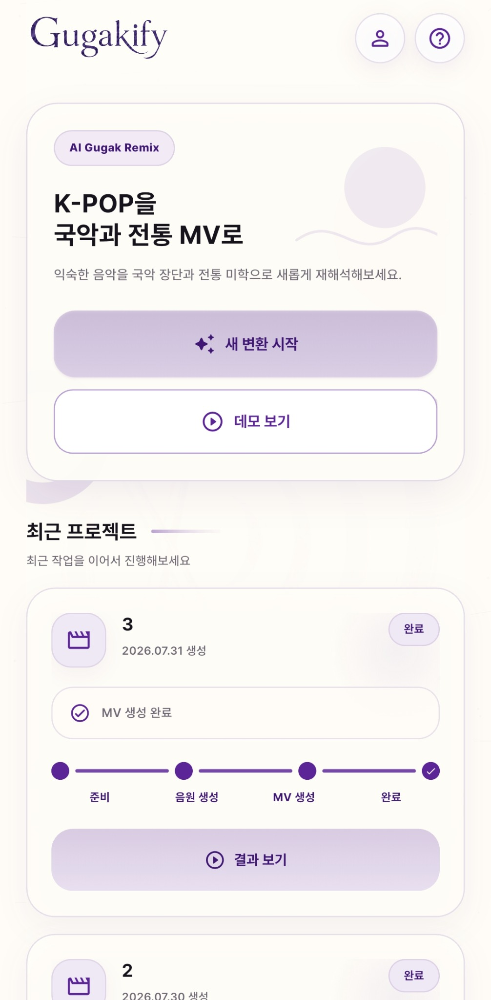<br>
      <b>홈</b><br>
      새 변환을 시작하고 최근 프로젝트의 진행 상태와 결과를 확인합니다.
    </td>
    <td align="center" width="33%">
      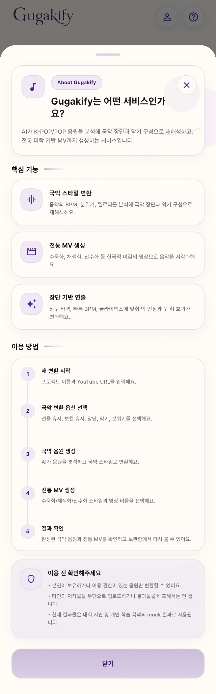<br>
      <b>서비스 소개</b><br>
      Gugakify의 핵심 기능과 전체 이용 방법, 저작권 안내를 제공합니다.
    </td>
  </tr>
  <tr>
    <td align="center">
      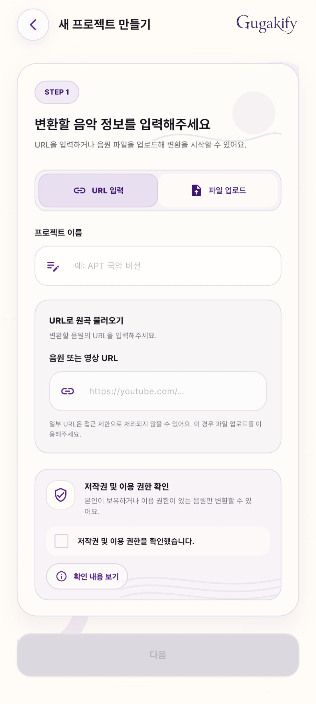<br>
      <b>음원 URL 입력</b><br>
      프로젝트 이름과 음원·영상 URL을 입력하여 변환을 시작합니다.
    </td>
    <td align="center">
      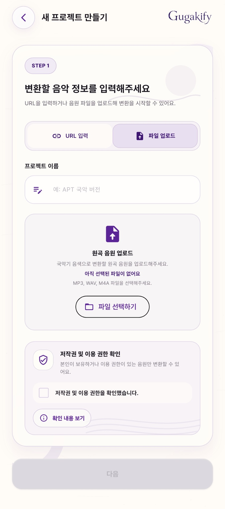<br>
      <b>음원 파일 업로드</b><br>
      MP3, WAV, M4A 파일을 선택하고 이용 권한을 확인합니다.
    </td>
    <td align="center">
      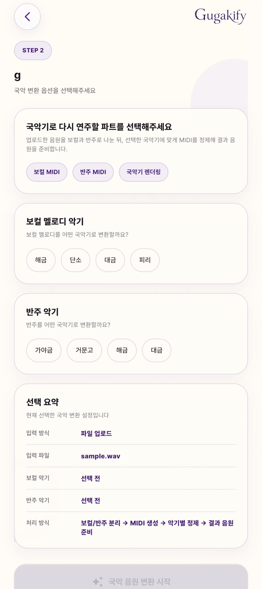<br>
      <b>국악 변환 설정</b><br>
      보컬 멜로디와 반주를 연주할 국악기를 각각 선택합니다.
    </td>
  </tr>
  <tr>
    <td align="center">
      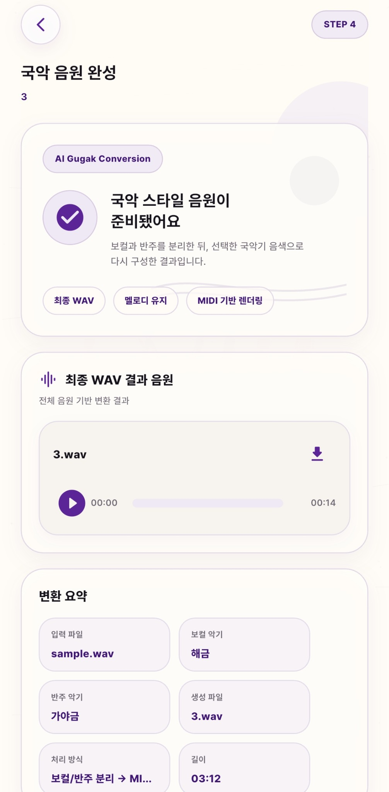<br>
      <b>국악 음원 완성</b><br>
      생성된 WAV 음원을 재생하거나 내려받고 변환 정보를 확인합니다.
    </td>
    <td align="center">
      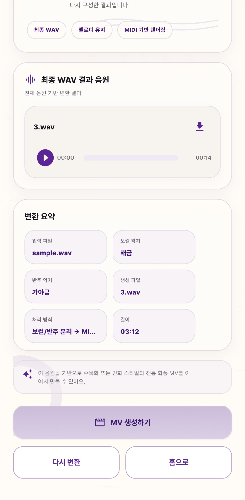<br>
      <b>음원 결과 상세</b><br>
      사용된 악기와 처리 방식, 파일명, 음원 길이를 요약해 보여줍니다.
    </td>
    <td align="center">
      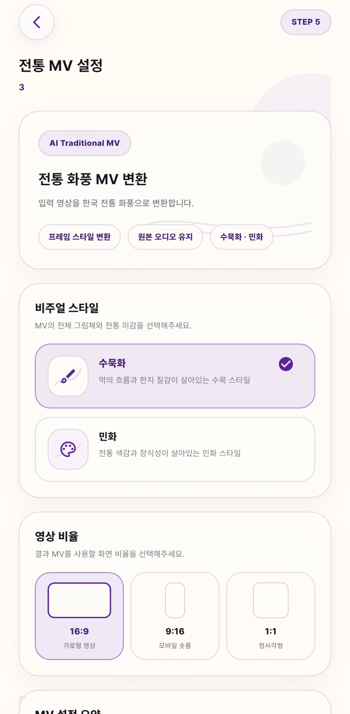<br>
      <b>전통 MV 설정</b><br>
      수묵화 또는 민화 스타일과 결과 영상의 화면 비율을 선택합니다.
    </td>
  </tr>
  <tr>
    <td align="center">
      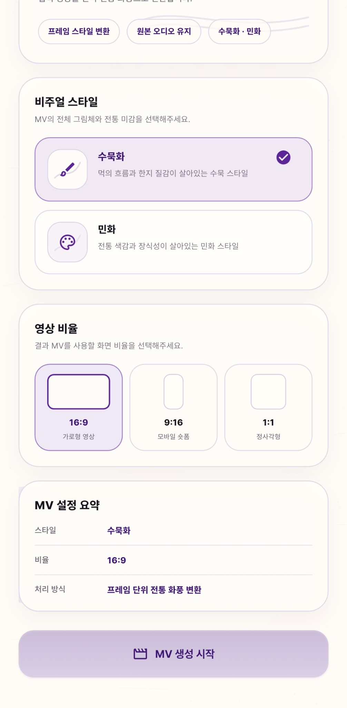<br>
      <b>MV 설정 요약</b><br>
      선택한 화풍과 영상 비율, 프레임 처리 방식을 확인합니다.
    </td>
    <td align="center">
      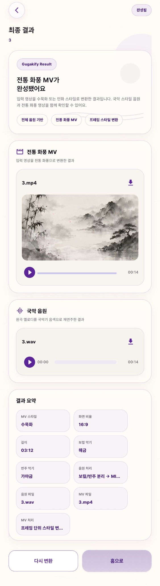<br>
      <b>최종 결과</b><br>
      완성된 전통 MV와 국악 음원을 재생하고 각각 다운로드합니다.
    </td>
    <td align="center">
      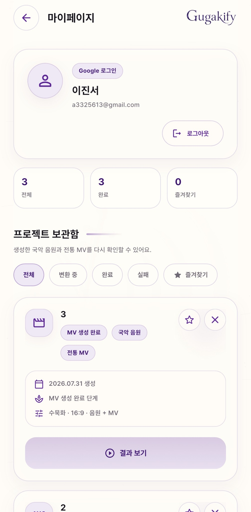<br>
      <b>마이페이지</b><br>
      사용자 정보와 프로젝트 상태, 즐겨찾기 및 생성 결과를 관리합니다.
    </td>
  </tr>
</table>

---

## 기술 스택

| 구분 | 기술 |
| --- | --- |
| Framework | Flutter |
| Language | Dart |
| Design | Figma |
| Authentication | Google Login / Firebase 연동 |
| Target | Android, Web |
| Version Control | Git, GitHub |

> 패키지와 정확한 버전 정보는 `pubspec.yaml` 및 `pubspec.lock`을 기준으로 확인합니다.

---

## 시작하기

### 1. 저장소 복제

```bash
git clone <FRONTEND_REPOSITORY_URL>
cd <FRONTEND_DIRECTORY>
```

### 2. 패키지 설치

```bash
flutter pub get
```

### 3. 개발 환경 확인

```bash
flutter doctor -v
flutter devices
```

### 4. 애플리케이션 실행

```bash
flutter run
```

Web에서 실행하려면 다음 명령을 사용합니다.

```bash
flutter run -d chrome
```

연결된 Android 기기 또는 에뮬레이터에서 실행하려면 다음 명령을 사용합니다.

```bash
flutter run -d <DEVICE_ID>
```

---

## Firebase 설정

Google 로그인을 사용하려면 팀에서 공유받은 Firebase 설정 파일을 각 플랫폼 경로에 추가해야 합니다.

```text
Android: android/app/google-services.json
iOS:     ios/Runner/GoogleService-Info.plist
```

Firebase 설정 파일과 API 키 등 민감한 정보는 공개 저장소에 업로드하지 않습니다.

---

## 코드 검사

코드를 올리기 전에 다음 명령을 실행합니다.

```bash
dart format .
flutter analyze
flutter test
```

---

## 프로젝트 구조

```text
frontend/
├── android/
├── assets/
├── docs/
│   └── screenshots/
├── lib/
│   ├── core/
│   ├── features/
│   ├── shared/
│   └── main.dart
├── test/
├── pubspec.yaml
└── README.md
```

> 실제 폴더 구조가 다른 경우 현재 프로젝트 구조에 맞게 이 부분을 수정합니다.

---

## 협업 규칙

### 브랜치 이름

```text
feature/<기능명>
fix/<수정내용>
docs/<문서내용>
```

### 커밋 메시지 예시

```text
feat: 음원 파일 업로드 기능 추가
fix: 결과 영상 재생 오류 수정
docs: 화면 소개 이미지 추가
```

---

## 저작권 안내

- 본인이 소유하거나 이용 권한이 있는 음원만 변환할 수 있습니다.
- 타인의 저작물을 무단으로 업로드하거나 결과물을 배포해서는 안 됩니다.
- 현재 결과물은 대회 시연 및 개인 학습 목적의 결과로 사용됩니다.

---

## 팀 정보

| 이름 | 역할 | 담당 |
| --- | --- | --- |
| 이름 | Frontend | Flutter UI 및 API 연동 |
| 이름 | Backend | 서버, 인증 및 데이터 관리 |
| 이름 | AI | 국악 음원 및 MV 생성 |
| 이름 | Design | UX/UI 및 Figma |

---

## License

본 프로젝트는 **2026 IT 경진대회 출품을 위해 개발된 프로젝트**입니다.